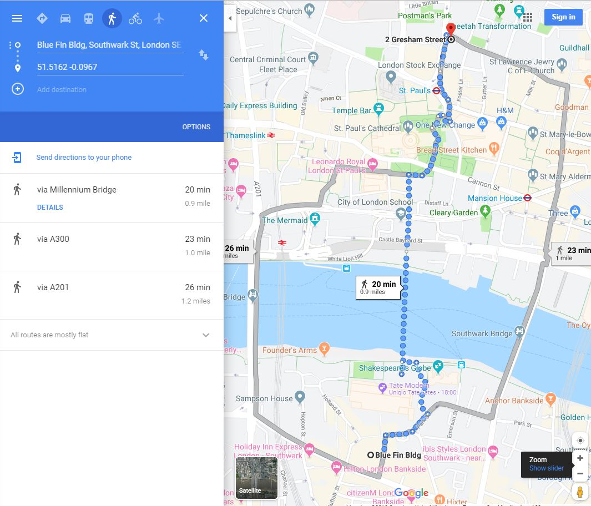

# TabPy_scripts-Google-API

**1. Calculating Distance Between Coordinate Points**

googlemaps_distance.py

Python script for Tableau Prep to calculate the walking distance between two coordinate points using Google Maps (Distance Matrix API)

This script is meant to be used with the Script object on Tableau Prep. It calculates the distance between two coordinate points (see example below). In the sample code, the origin point is set as static, whereas the destinations points are read from a dataframe.

**2. Retrieve Coordinate Points for Street Address**

Street_address_to_coordinates.py

Script for Tableau Prep to get coordinate points for given street address by using Google Geocoding API. The example script takes the street and city from a dataframe and then passes these to the API. The coordinates are stored ine new columns, latitude and longitude.
